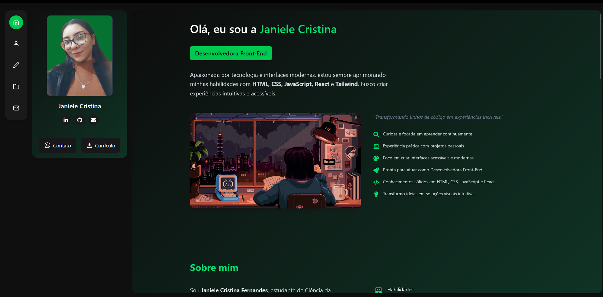

# 👩‍💻 Portfólio - Janiele Cristina

 

Portfólio desenvolvido com React e Tailwind CSS para apresentar meus projetos, habilidades, trajetória e formas de contato. Uma vitrine moderna que reflete minha identidade como desenvolvedora Front-End.

---

## ✨ Sobre mim

Sou **Janiele Cristina**, estudante de Ciência da Computação e desenvolvedora Front-End.  
Apaixonada por tecnologia, interfaces modernas e acessibilidade, estou sempre aprimorando minhas habilidades com **HTML, CSS, JavaScript, React e Tailwind**.

Busco criar experiências intuitivas, responsivas e com propósito — e este portfólio é uma forma de mostrar isso na prática 🚀

---

## 💻 Tecnologias utilizadas

- **React** – Biblioteca principal da interface
- **Tailwind CSS** – Estilização moderna e rápida
- **Framer Motion** – Animações suaves (se usadas)
- **Vercel** – Deploy

---

## 🚀 Acesso ao projeto

- **Link ao vivo:** [portfolio-mis7.vercel.app](https://portifolio-mis7.vercel.app/)
- **Repositório:** [github.com/JanieleCristina006/Portfolio-MIS7](https://github.com/JanieleCristina006/Portifolio-)

---

## 🧩 Funcionalidades

- 📌 Apresentação com foto e resumo profissional
- 🧭 Navegação lateral entre seções
- 📂 Exibição dos projetos com título, imagem, descrição, tecnologias, GitHub e deploy
- 📜 Currículo disponível para download
- 📱 Responsivo para diferentes tamanhos de tela
- 📬 Seção de contato com links para WhatsApp, LinkedIn, GitHub e e-mail
